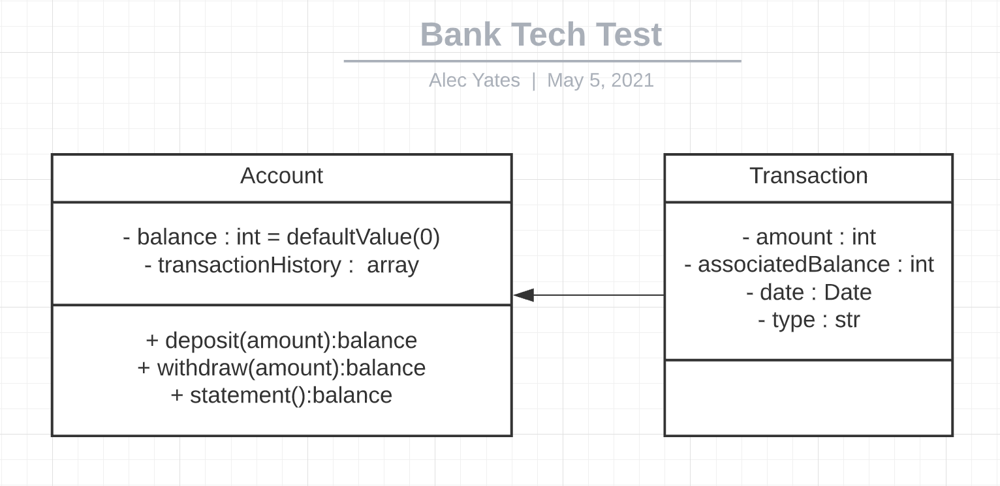

# Bank Tech Test

A simple banking program, written in Javascript

### Testing

#### Unit Testing
* Jest was used for the testing of this project. For setup, run the following within the directory:

```
npm install --save-dev jest-extended
```
* Then, ensure the following is in your package.json:

```
  "scripts": {
    "test": "jest"
  },
  "jest": {
    "setupFilesAfterEnv": ["jest-extended"]
  }
```

* Now, simply enter `jest --coverage` in your command line to run the existing testing suite, with included coverage data.

#### Feature Testing
* For feature testing, open the provided index.html file in chrome, open the console, and enter any of the following commands to see the response. (The examples given carry out the requirements of the acceptance criteria)
```console
testAccount = new Account();
```
```console
testAccount.deposit(1000, '10/01/2012');
```
```console
testAccount.deposit(2000, '13/01/2012');
```
```console
testAccount.withdraw(500, '14/01/2012');
```
```console
testAccount.statement();
```

### User Requirements

The requirements for this challenge were provided as following:

* You should be able to interact with your code via a REPL like IRB or the JavaScript console.  (You don't need to implement a command line interface that takes input from STDIN.)
* Deposits, withdrawal.
* Account statement (date, amount, balance) printing.
* Data can be kept in memory (it doesn't need to be stored to a database or anything).

### Acceptance criteria

**Given** a client makes a deposit of 1000 on 10-01-2012  
**And** a deposit of 2000 on 13-01-2012  
**And** a withdrawal of 500 on 14-01-2012  
**When** she prints her bank statement  
**Then** she would see

```
date || credit || debit || balance
14/01/2012 || || 500.00 || 2500.00
13/01/2012 || 2000.00 || || 3000.00
10/01/2012 || 1000.00 || || 1000.00
```
## Solution Planning

### Class Diagram



### Design Progression

Given the acceptance and user requirements, I will build my program up, in the following inputs and outputs:

| input  |  output  |
| ------ |  ------- |
| deposit 10 | balance increases by 10 |
| withdraw 10 | balance decreases by 10 |
| deposit 10 | statement function returns amount of 10 |
| withdraw 10 | statement funciton returns amount of 10 |
| deposit 10 | statement function also returns balance of 10 |
| withdraw 10 | statement function also returns balance of 10 less |
| deposit | statement function also returns date of transaction |
| withdrawal | statement function also returns date of transaction |
| multiple transactions | statement returns data of multiple transactions |
| single deposit | statement returns data in correct formatting |
| single withdrawal | statement returns data in correct formatting |
| multiple transactions | statement returns data in correct formatting | 

### Further Consideration

As they are not covered in the requirements, and perhaps would be handled by a different system, I will not be designing the handling of certain edge cases.

However, given the go ahead, I would look to prevent the following:
* Withdrawls that are greater than the current balance
* Transactions that are parsed with the incorrect data e.g. the wrong data type, negative integers, dates that precede the previous transaction/current date etc.

I would also consider improving the system in the following ways:
* Using Date instances to improve accuracy within the transactions
* External and secured storage of information as well as encrytped account details
* Unique identifier numbers, attached to Account instances

### Code Quality

Jest and the community supported jest-extended matchers were used for testing. This decision was made due to the affable interface and the built in coverage capabilities of jest, along with the flexibility and accuracy that the extended matchers provide.

The code within this project was passed through ESLint to ensure it fit with standard conventions.
